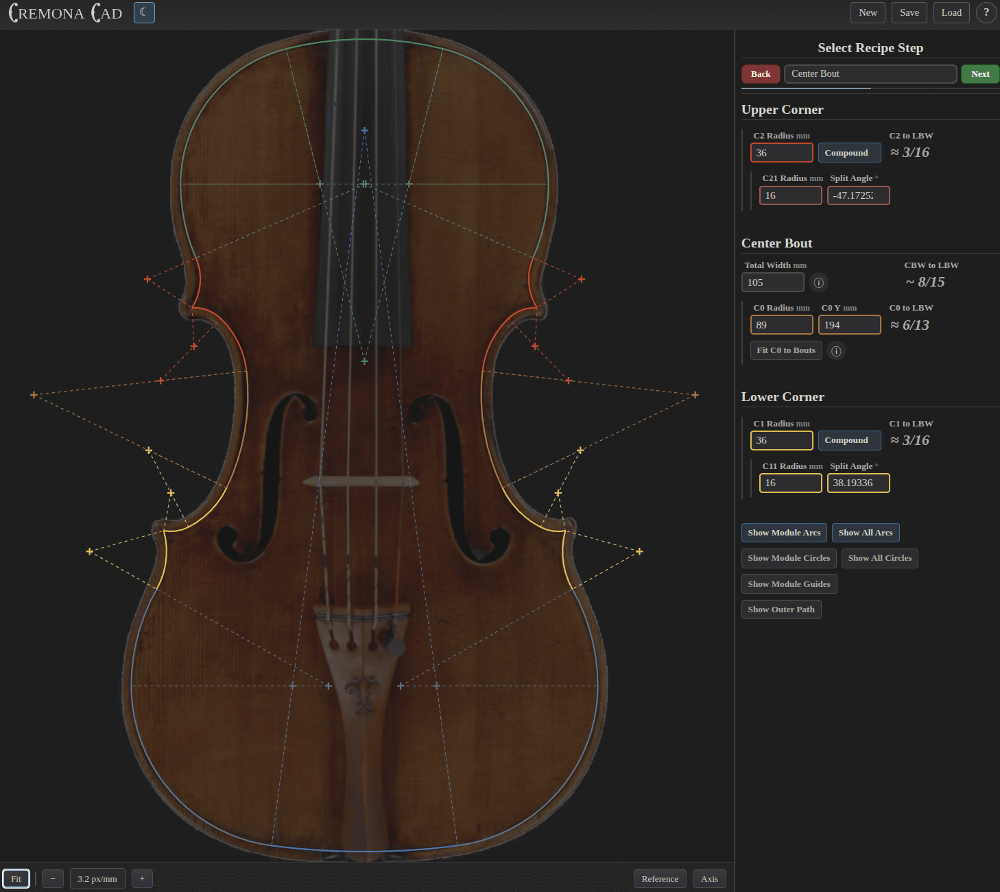

# Cremona CAD

A free and open source application for designing violin family instruments.

**[cremonacad.aargraves.com](https://cremonacad.aargraves.com)**

---


## About



Rather than a static trace, or a complex list of coordinates, CremonaCad defines instruments using a simple system of **intersecting arcs**. These patterns are historically informed by a drafting document found in the workshop of **Enrico Ceruti**, as well as the research of American luthiers **David Beard** and **Kevin Kelly**.

Upload a historical instrument and use it as a reference, or go off the rails and create something totally unique. Once your design is complete, CremonaCad can create moulds and templates for your specific instrument. These patterns can be exported either as PDFs for traditional hand-making, or as SVGs for computer assisted fabrication.

## Getting Started

### Prerequisites

- [Node.js](https://nodejs.org/) v18+
- [Angular CLI](https://angular.dev/tools/cli) v21+

```bash
npm install -g @angular/cli
```

### Run locally

```bash
git clone https://github.com/TheGravyBaby/cremona-cad.git
cd cremona-cad
npm install
ng serve
```

Open your browser to `http://localhost:4200`.

### Build

```bash
ng build
```

Output goes to `dist/`.

## For Developers

The `src/app/hello-recipe/` component is a minimal working recipe — a good starting point if you want to experiment with building your own.

The `examples/` directory contains the archived Beard and Kelly violin recipes. These are not wired into the main application but are useful as reference implementations.

Recipe components follow the structure established in `recipe-base/`. The draft canvas (`draft-canvas/`) accepts an array of draw functions and handles rendering, pan/zoom, the axis grid, and reference image overlay.

## Project Structure

```
src/app/
├── enrico-ceruti-violin/  # Primary working recipe
├── hello-recipe/          # Minimal recipe for experimentation
├── draft-canvas/          # SVG canvas, camera, axis grid, reference image
├── helpers/               # Math, render functions, SVG/PDF export
├── models/                # Shared TypeScript types
├── recipe-base/           # Base class shared across all recipes
├── shared/                # Message service and UI components
└── top-bar/               # Application toolbar

examples/
├── beard-violin/          # Archived Beard recipe
└── kelly-violin/          # Archived Kelly recipe
```

## Contributing

Feedback, ideas, and collaboration are welcome from anyone in the making community. Whether that's a new recipe method, improvements to the geometry engine, UI polish, or documentation — open an issue or submit a pull request.

```
git checkout -b feature/my-feature
```

## Tech Stack

- [Angular 21](https://angular.dev/)
- [D3.js](https://d3js.org/)

## License

Released under the **GNU General Public License v3.0 (GPL-3.0)**.

You are free to use, modify, and distribute this software under the terms of the GPL-3.0 license. Any derivative works must also be distributed under the same license.

## Author

Andrew Argraves — musician and software engineer based out of New Haven, CT.

CremonaCad started as a personal tool to understand the geometry behind historical violin patterns. After months of development and experimentation, it became something that might be genuinely useful in developing the craft of violin-making.

[andrewargraves@gmail.com](mailto:andrewargraves@gmail.com)

Thanks, and happy drafting!
