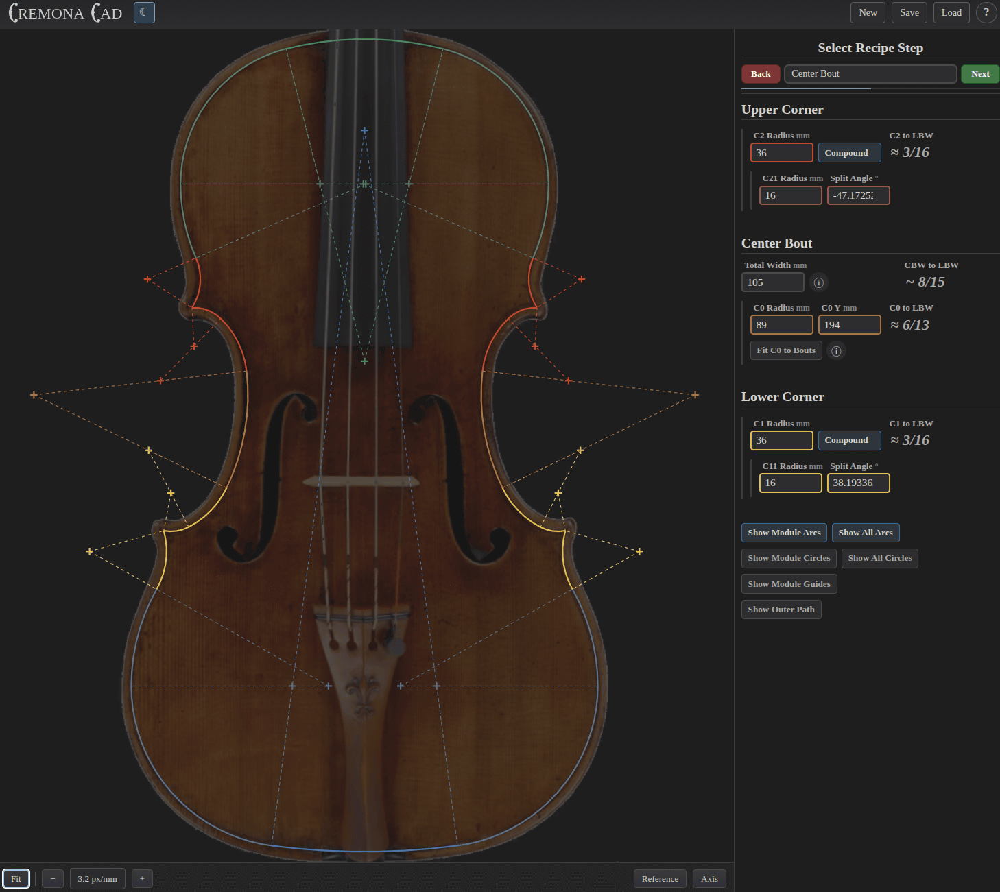

# Cremona CAD

A free and open source application for designing violin family instruments.

**[cremonacad.aargraves.com](https://cremonacad.aargraves.com)**

---


## About



Rather than a static trace, or a complex list of coordinates, CremonaCad defines instruments using a simple system of **intersecting arcs**, historically informed by a drafting document found in the workshop of **Enrico Ceruti**, as well as the research of American luthiers **David Beard** and **Kevin Kelly**.

The outline is drawn from parameters — bout widths, corner placements, cutoff angles — which then carry through to purfling, fluting, long and cross arching, and the internal mould. A **drawing toolbox** sits alongside the recipe for sketching and tracing directly on the canvas, snapping to the geometry underneath. Finished designs export as SVG, PDF and DXF for templates and moulds, and as STL for CNC-carved plates.

See the in-app **About** and **Tutorial** tabs for the full picture, including the design workflow and each panel in turn.

## Getting Started

### Prerequisites

- [Node.js](https://nodejs.org/) v20.19+, v22.12+, or v24+
- [Angular CLI](https://angular.dev/tools/cli) v21+

```bash
npm install -g @angular/cli
```

### Run locally

```bash
git clone https://github.com/TheGravyBaby/cremona-cad.git
cd cremona-cad
npm install
ng serve
```

Open your browser to `http://localhost:4200`.

### Build

```bash
ng build
```

Output goes to `dist/`.

### Test

```bash
ng test
```

Unit tests run under [Vitest](https://vitest.dev/) via `@angular/build:unit-test`. Use `ng test --watch=false` for a single pass.

## For Developers

The `src/app/hello-recipe/` component is a minimal working recipe — a good starting point if you want to experiment with building your own.

The `examples/` directory contains the archived Beard and Kelly violin recipes. These are not wired into the main application but are useful as reference implementations.

Recipe components follow the structure established in `recipe-base/`, which owns the save/load file format, undo/redo, and the panel scaffolding. The draft canvas (`draft-canvas/`) accepts an array of draw functions and handles rendering, pan/zoom and the axis grid; it also hosts the drawing toolbox, whose shapes and reference images are saved into the recipe file alongside the parameters.

A few conventions worth knowing before editing geometry code:

- **World space is Y-up and measured in millimetres.** The canvas root group carries a `scale(1,-1)`, so anything appended to it is written in ordinary maths coordinates rather than SVG's Y-down ones.
- **Geometry math lives in `helpers/draftMath.ts`.** Recipe calculations and canvas tools share it. `helpers/svgPathMath.ts` turns that geometry into path data; `helpers/renderFuncs.ts` draws it.
- **`models/types.ts` and `draft-canvas/tools/toolbox-shape.ts` are deliberately separate.** The former holds the classes recipes use; the latter is a plain-object union for the toolbox, which round-trips through JSON on every edit and so cannot carry prototypes. They share math, not types — see the notes at the top of each file.

## Project Structure

```
src/app/
├── about-modal/           # About, tutorial, changelog and license
├── draft-canvas/          # SVG canvas, camera, axis grid
│   ├── tools/             #   Drawing toolbox: tools, snapping, layers, images
│   ├── tool-palette/      #   Toolbar and layer/image panels
│   └── settings-bar/      #   Per-shape properties for the current selection
├── enrico-ceruti-violin/  # Primary working recipe
│   ├── panels/            #   One input panel per design stage
│   ├── renders/           #   Arching, 3D preview and guide renderers
│   └── render-toggles/    #   Module and view visibility controls
├── helpers/               # Math, render functions, SVG/PDF/DXF/STL export
├── hello-recipe/          # Minimal recipe for experimentation
├── models/                # Shared TypeScript types
├── recipe-base/           # Base class shared across all recipes
├── recipe-toolbar/        # New/save/load and template selection
├── shared/                # Message service and UI components
└── top-bar/               # Application toolbar

examples/
├── beard-violin/          # Archived Beard recipe
├── kelly-violin/          # Archived Kelly recipe
└── shared/                # Older math helpers those two still depend on
```

## Contributing

Feedback, ideas, and collaboration are welcome from anyone in the making community. Whether that's a new recipe method, improvements to the geometry engine, UI polish, or documentation — open an issue or submit a pull request.

```
git checkout -b feature/my-feature
```

## Tech Stack

- [Angular 21](https://angular.dev/) — standalone components, no state library
- [D3.js](https://d3js.org/) — SVG rendering and canvas interaction
- [jsPDF](https://github.com/parallax/jsPDF) + [svg2pdf.js](https://github.com/yWorks/svg2pdf.js) — PDF export
- [polygon-clipping](https://github.com/mfogel/polygon-clipping) — boolean operations on outlines
- [svg-path-properties](https://github.com/rveciana/svg-path-properties) — sampling paths into polylines off-screen
- [Vitest](https://vitest.dev/) — unit tests

DXF and STL export are written directly, without a dependency.

## License

Released under the **GNU General Public License v3.0 (GPL-3.0)**.

You are free to use, modify, and distribute this software under the terms of the GPL-3.0 license. Any derivative works must also be distributed under the same license.

## Author

Andrew Argraves — musician and software engineer based out of New Haven, CT.

CremonaCad started as a personal tool to understand the geometry behind historical violin patterns. After months of development and experimentation, it became something that might be genuinely useful in developing the craft of violin-making.

[andrewargraves@gmail.com](mailto:andrewargraves@gmail.com)

Thanks, and happy drafting!
